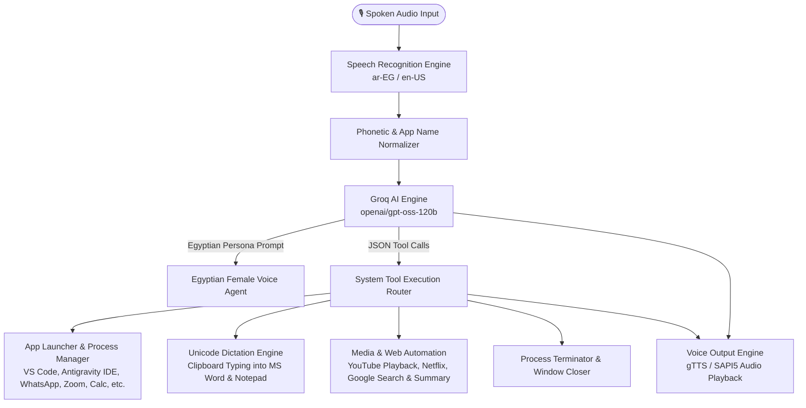

# 🎙️ Egyptian Voice Assistant — Desktop Automation & Voice Agent

[](https://www.python.org/)
[](https://console.groq.com/)
[](https://pypi.org/project/SpeechRecognition/)
[](https://pypi.org/project/gTTS/)

A voice-controlled desktop assistant built with Python that combines LLM tool calling with Windows system automation. It supports Egyptian Arabic and English for voice input, desktop application control, dictation, and web searches.

The assistant uses **Groq LLM API** (`openai/gpt-oss-120b`) to infer user intent from spoken prompts without relying on rigid keyword matching. It dynamically executes tools to open software, write dictated text into Microsoft Word and Notepad, control media playback, and perform web searches.

---

## 🏗️ Architecture Overview



---

## 🔑 Technical Features

### 🧠 1. Natural Intent LLM Function Calling
- Uses **Groq's LLM API** to map natural conversational speech into structured JSON tool calls.
- Routes prompts dynamically without fixed command keywords (e.g., *"عندي ملاحظات عاوزة أكتبها"* opens Notepad dictation; *"عندي معادلة محتاجة أحسبها"* opens Calculator).

### ✍️ 2. Unicode Dictation Engine
- **Supports Arabic & English**: Uses clipboard pasting (`pyperclip` + `pyautogui` `Ctrl + V`) to write spoken Unicode text directly into **Microsoft Word** and **Notepad**.
- **Natural Exit Detection**: Checks for conversational completion phrases (*"خلصت"*, *"أنا كدا تمام"*, *"done"*, *"finished"*) to end dictation mode and close the application window.

### 💻 3. Application & Process Management
- **Single-Instance Application Launching**: Checks running processes via `tasklist` (`is_app_running`) to avoid launching duplicate process instances.
- **Desktop & UWP App Support**: Launches desktop executables and Windows protocol URIs for **VS Code**, **Antigravity IDE**, **WhatsApp**, **Zoom**, **Microsoft Teams**, **Spotify**, **Discord**, **File Explorer**, and **Command Prompt**.
- **Force Re-open**: Supports `force=True` when the user explicitly requests a fresh window or indicates an app didn't launch.
- **Process Termination**: Closes windows cleanly using Windows `taskkill` and `Alt + F4`.

### 🌐 4. Web Search & Information Retrieval
- Opens Google Search directly in the default web browser.
- Queries Wikipedia REST API to extract factual summaries and provide spoken answers to user questions.

### 🔊 5. Voice Output (gTTS & SAPI5)
- Uses **Google Text-to-Speech (`gTTS`)** played via `pygame` for Arabic audio output.
- Includes a fallback to **Windows SAPI5** (`Microsoft Zira`) for offline voice synthesis.

---

## 🛠️ Tech Stack

| Component | Technology / Library |
| :--- | :--- |
| **Language** | Python 3.10+ |
| **LLM Inference** | Groq API (`groq` SDK / `openai` client with `openai/gpt-oss-120b`) |
| **Speech Recognition** | `SpeechRecognition` + PyAudio (Google Speech API `ar-EG` & `en-US`) |
| **Text-to-Speech (TTS)** | `gTTS`, `pygame.mixer`, `pyttsx3`, `win32com.client` (SAPI5) |
| **Desktop Automation** | `pyautogui`, `pyperclip` (Unicode clipboard typing) |
| **Process Control** | Windows `tasklist`, `taskkill`, `subprocess` |
| **Web & Media** | `webbrowser`, `requests`, `pywhatkit`, `googlesearch-python` |
| **Environment** | `python-dotenv` |

---

## 📁 Project Structure

```
├── audio_assistant.py     # Main loop, speech recognition, and audio output
├── groq_engine.py         # Groq LLM client setup, system prompt, and function calling router
├── laptop_tools.py        # System automation, app launcher, dictation, and web search tools
├── requirements.txt       # Python package dependencies
├── .env.example           # Environment template for GROQ_API_KEY
├── .gitignore             # Git ignore rules for virtualenvs, keys, and cache
└── README.md              # Project documentation
```

---

## 🚀 Setup & Installation

### 1. Prerequisites
- Windows 10 / 11
- Python 3.10+
- Microphone & Speakers
- Groq API Key from [console.groq.com/keys](https://console.groq.com/keys)

### 2. Environment Setup

```powershell
# Clone the repository
git clone https://github.com/your-username/Desktop-Voice-Automation-Agent.git
cd Desktop-Voice-Automation-Agent

# Create virtual environment
python -m venv venv

# Activate virtual environment
.\venv\Scripts\Activate.ps1

# Install dependencies
pip install -r requirements.txt
```

### 3. Configure Environment Variables

Create `.env` from `.env.example`:

```powershell
cp .env.example .env
```

Add your Groq API key to `.env`:
```env
GROQ_API_KEY=gsk_your_actual_groq_api_key_here
GROQ_MODEL=openai/gpt-oss-120b
```

### 4. Run the Assistant

```powershell
python audio_assistant.py
```

---

## 🎙️ Example Commands

| Intent | Example Prompt | Action Taken |
| :--- | :--- | :--- |
| **Word Dictation** | *"افتخي وورد واكتبي صباح الخير النهار ده يوم جميل"* | Opens MS Word, types text live via clipboard, enters dictation mode. |
| **Notepad Dictation** | *"عاوزة أكتب شوية ملاحظات في النوت باد"* | Opens Notepad, types spoken text until user says *"أنا كدا خلصت"*. |
| **App Launching** | *"افتحيلي انتي جرافيتي ايدي"* / *"Open VS Code"* | Launches Antigravity IDE / VS Code executable or URI protocol. |
| **Messaging** | *"افتحي الواتساب"* / *"Open Zoom"* | Opens WhatsApp Desktop / Zoom via protocol URI. |
| **App Closing** | *"اقفلي الورد"* / *"اقفلي النوت باد"* | Executes `taskkill` to close Microsoft Word / Notepad. |
| **YouTube** | *"شغلي أغنية لعمرو دياب على يوتيوب"* | Opens YouTube and plays requested search query. |
| **Web Search** | *"اعملي سيرش عن أهرامات الجيزة"* | Opens Google Search in browser and reads aloud a summary. |
